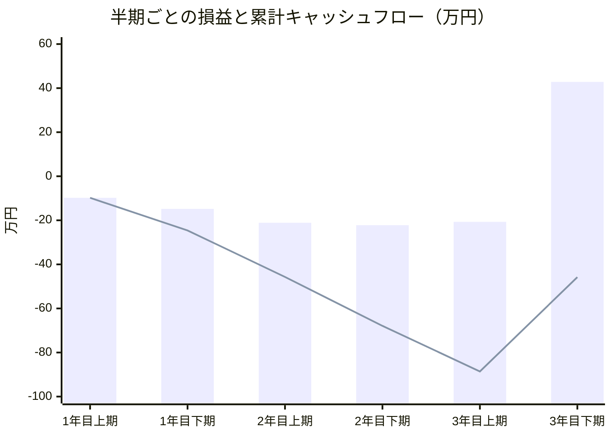
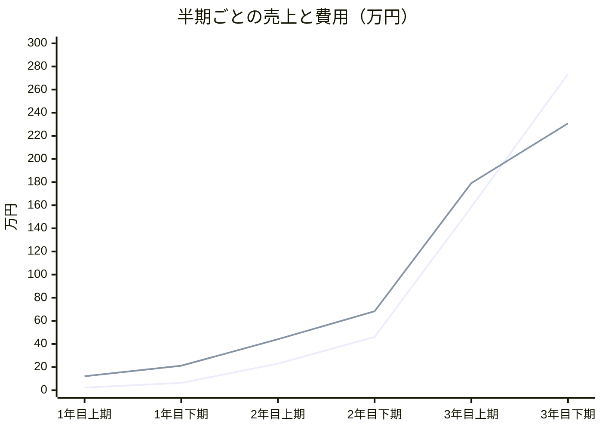

# 収支計画 — 半期ごとのキャッシュフロー

作成日: 2026-08-19 / ステータス: **試算（すべて仮置き。Phase 0 の実測で差し替える）**
出典: `docs/エントリーシート記入内容.md` §6 / `20260819/エントリーシート_収支計画_改訂案.md`
関連: `20260819/人件費の考え方.md` / `20260818/収支再計算.md`

> 年次の収支表を半期（6ヶ月）単位に分解したもの。**年次の合計値はエントリーシート §6 と完全に一致する**（§4 で検算）。
> 分解によって、年次の表では見えていなかった**資金需要のピーク**が明らかになった（§3）。

---

## 0. 結論（先に3点）

1. **単月ベースの黒字転換は3年目下期。** それまで5期連続で赤字が続く。

2. **累計では3年目末でも回収できていない（▲45.8万円）。** 年次の表は「3年後に利益22.1万円」と読めるが、それは**その年度単独の利益**であり、それまでの累積赤字を埋め切ってはいない。**累計での黒字化は4年目以降。**

3. **最大の資金需要は3年目上期末の ▲88.6万円。** つまり**黒字化に到達するまでに約90万円の資金が必要**であり、これは年次の表からは読み取れない。エントリーシートに資金調達の記載がない現状では、ここを聞かれると答えられない。

---

## 1. 年次の収支計画（エントリーシート §6）

| 項目 | 1年後 | 3年後 |
| --- | --- | --- |
| 売上高（a） | 8.6万円 | 432.0万円 |
| 売上原価（仕入高）（b） | 18.3万円 | 193.9万円 |
| 経費（c）人件費 | 0万円 | 120.0万円 |
| 経費（c）家賃 | 0万円 | 0万円 |
| 経費（c）広告宣伝費 | 3.0万円 | 60.0万円 |
| 経費（c）その他 | 12.0万円 | 36.0万円 |
| 経費（c）合計 | 15.0万円 | 216.0万円 |
| 利益（a－b－c） | ▲24.7万円 | 22.1万円 |

---

## 2. 半期ごとのキャッシュフロー

### 2.1 前提（利用者数の推移）

年次の平均値から逆算した、各期の**期間平均**の利用者数。

| 期 | 平均MAU | 移行率 | 有料 | 無料 | AI原価（無料/有料・月） |
|---|---:|---:|---:|---:|---|
| 1年目上期 | 250 | 3% | 8 | 242 | 27.0円 / 70.0円 |
| 1年目下期 | 750 | 3% | 22 | 728 | 27.0円 / 70.0円 |
| 2年目上期 | 2,000 | 4% | 80 | 1,920 | 16.2円 / 42.0円 |
| 2年目下期 | 4,000 | 4% | 160 | 3,840 | 16.2円 / 42.0円 |
| 3年目上期 | 11,000 | 5% | 550 | 10,450 | 6.6円 / 18.0円 |
| 3年目下期 | 19,000 | 5% | 950 | 18,050 | 6.6円 / 18.0円 |

年度末のMAUは 1年目1,000人 → 2年目5,000人 → 3年目20,000人 を想定。
AI原価は撮影・提案の単価圧縮（1.0円→0.6円→0.3円 / 0.5円→0.3円→0.1円）を年度ごとに反映している。

### 2.2 半期損益

| 期 | 売上高 | 売上原価 | 経費 | **半期損益** | **累計** |
|---|---:|---:|---:|---:|---:|
| 1年目上期 | 2.3万円 | 4.6万円 | 7.5万円 | **▲9.8万円** | ▲9.8万円 |
| 1年目下期 | 6.3万円 | 13.7万円 | 7.5万円 | **▲14.8万円** | ▲24.6万円 |
| 2年目上期 | 23.0万円 | 24.1万円 | 20.0万円 | **▲21.1万円** | ▲45.7万円 |
| 2年目下期 | 46.1万円 | 48.3万円 | 20.0万円 | **▲22.2万円** | ▲67.9万円 |
| 3年目上期 | 158.4万円 | 71.1万円 | 108.0万円 | **▲20.7万円** | **▲88.6万円** ← 資金需要のピーク |
| 3年目下期 | 273.6万円 | 122.8万円 | 108.0万円 | **＋42.8万円** | ▲45.8万円 |

---

## 3. グラフ

### 3.1 半期損益（棒）と累計キャッシュフロー（線）

**棒 = その期単独の損益 / 線 = 累計キャッシュ**

線が最も深く沈むのが3年目上期末の **▲88.6万円**。ここが必要な資金の底であり、**この谷を越えられなければ黒字化に到達しない。**

### 3.2 売上と費用の推移

**上に伸びる線 = 売上 / もう一方 = 費用（売上原価＋経費）**

2本が交差するのは **3年目上期と下期の間**。それまでは一貫して費用が売上を上回る。
交差を生んでいるのは利用者数の増加そのものではなく、**AI 利用料の単価圧縮**（無料1人あたり 27.0円 → 6.6円）である。圧縮ができなければ2本は交差しない。

---

## 4. 検算（年次の合計がエントリーシート §6 と一致するか）

| 年度 | 項目 | 半期の合計 | エントリーシート §6 | 一致 |
|---|---|---:|---:|:--:|
| 1年目 | 売上高 | 8.64万円 | 8.6万円 | ○ |
| | 売上原価 | 18.27万円 | 18.3万円 | ○ |
| | 経費 | 15.0万円 | 15.0万円 | ○ |
| | 利益 | ▲24.6万円 | ▲24.7万円 | ○（端数処理の差） |
| 2年目 | 売上高 | 69.1万円 | 69.1万円（参考値） | ○ |
| | 売上原価 | 72.4万円 | 72.4万円（参考値） | ○ |
| | 利益 | ▲43.3万円 | ▲43.3万円（参考値） | ○ |
| 3年目 | 売上高 | 432.0万円 | 432.0万円 | ○ |
| | 売上原価 | 193.9万円 | 193.9万円 | ○ |
| | 経費 | 216.0万円 | 216.0万円 | ○ |
| | 利益 | 22.1万円 | 22.1万円 | ○ |

**半期への分解は、既存の年次計画と矛盾していない。** 新しい前提を持ち込んでおらず、年次の平均値を期間内で配分し直しただけである。

---

## 5. この分解で新しく分かったこと

### 5.1 年次の表は「3年後に黒字」に見えるが、累計では赤字のまま

エントリーシート §6 は「3年後の利益 22.1万円」と書いている。これは**3年目という年度単独の利益**であり、1年目▲24.7万・2年目▲43.3万を合わせた累積は **▲45.8万円** のまま残る。

**累計での黒字化は4年目以降。** 現状のエントリーシートはこの区別を書いていないため、「3年で黒字になる事業」と読まれる余地がある。指摘されたときに答えられるよう、明示しておくべき。

### 5.2 約90万円の資金が必要だが、調達の記載がない

累計の谷は3年目上期末の▲88.6万円。**これが事業を継続するために必要な資金の総額**である。現在のエントリーシートには資金調達・自己資金についての記載がない。

考えられる調達手段（いずれも未検討）:

| 手段 | 備考 |
|---|---|
| グランプリの賞金・支援 | 受賞が前提であり計画には織り込めない |
| 自治体のフードロス削減・子育て支援の実証事業 | `20260818/収益モデル案.md` B-4。**現段階のチームが最初に現金を得る最現実的な経路**として既に挙がっている |
| 学校・高専の研究予算 | エントリーシート §148 に高専教員の技術指導の記載あり。予算面の可能性は未確認 |
| 支出の後ろ倒し | 3年目の広告宣伝費60万円・その他36万円を削れば谷は浅くなる。**成長を遅らせる代わりに生き延びる選択** |

### 5.3 赤字の性質が年度で違う

| 期間 | 赤字の主因 |
|---|---|
| 1〜2年目 | **無料利用者の AI 利用料。** 売上が小さく、原価が売上を上回っている |
| 3年目上期 | **固定費。** 原価率は改善済み（売上158.4万 > 原価71.1万）だが、経費108万（うち人件費60万）が重い |

つまり **1〜2年目は「単価を下げる」問題、3年目は「固定費を出せる規模に届いているか」の問題**であり、打ち手が違う。混同して「利用者を増やせば解決する」と考えないこと。

---

## 6. 次の一手

1. **エントリーシートに「累計」の視点を1行足すか判断する。** 現在は年度単独の利益しか書いていない（→ AQ-002 に含める場合は CEO 判断）
2. **必要資金 約90万円の調達方針を決める。** 特に B-4（自治体の実証事業）は収益源としてだけでなく**運転資金の調達手段**としても機能する
3. Phase 0 で AI 原価の実測値が出たら、本ファイルの単価前提（27.0円 / 16.2円 / 6.6円）を差し替えて引き直す

**本ファイルの数値はすべて仮置きの前提に基づく試算であり、実測値ではない。** 特に AI 利用料の単価圧縮（無料1人 27.0円 → 6.6円）は未実証であり、これが実現しない場合、売上と費用の線は交差しない。
